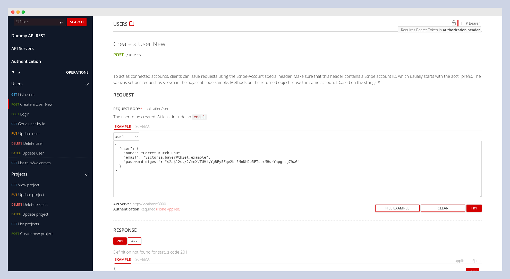

# OasRails

OasRails is a Rails engine that automatically generates OpenAPI documentation for your application. It provides an interactive UI powered by RapiDoc, allowing you to explore and test your API endpoints easily.
